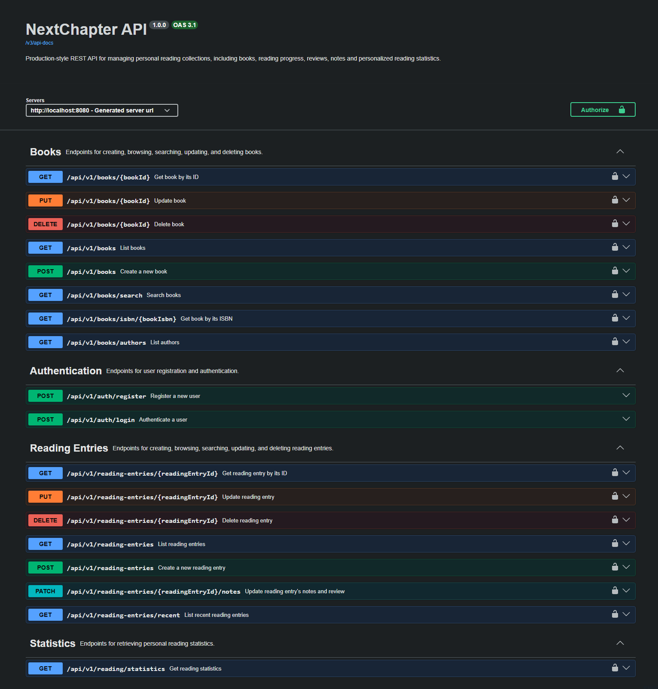

# NextChapter API


A production-style REST API for managing personal reading collections.

The application combines a centralized book catalog with user-specific reading entries, allowing each user to track reading progress, ratings, reviews, personal notes, and reading statistics.

Built with Java and Spring Boot, the project demonstrates modern backend development practices including JWT authentication, Spring Data JPA, Docker-based development, and cloud deployment to AWS using Amazon ECS (Fargate) and Amazon RDS.

## API Preview



---

## Project Highlights

- RESTful API built with Spring Boot
- JWT authentication and authorization
- User registration and login
- CRUD operations for books
- Dynamic filtering using Spring Data JPA Specifications
- MySQL persistence with Hibernate
- Interactive API documentation with Swagger / OpenAPI
- Dockerized local development environment
- Cloud deployment on AWS (ECS Fargate + RDS)

---

## Architecture

### Application Architecture

```text
                   Client
                      │
                      ▼
             Spring Boot REST API
              (Docker Container)
                      │
                      ▼
              MySQL Database
```

### Cloud Deployment

```text
              GitHub Repository
                      │
                      ▼
                Docker Image
                      │
                      ▼
               Amazon ECR Registry
                      │
                      ▼
          Amazon ECS Service (Fargate)
                      │
                      ▼
         Spring Boot Container Instance
                      │
                      ▼
              Amazon RDS MySQL
```

---

## Technology Stack

| Category | Technologies |
|----------|--------------|
| Language | Java 25 |
| Framework | Spring Boot |
| Security | Spring Security, JWT |
| Persistence | Spring Data JPA, Hibernate |
| Database | MySQL |
| Documentation | Swagger / OpenAPI |
| Containerization | Docker, Docker Compose |
| Cloud | Amazon ECS (Fargate), Amazon ECR, Amazon RDS, CloudWatch |
| Build Tool | Maven |

---

## Core Capabilities

### Authentication & User Management

Secure user authentication using JWT tokens.

- User registration
- User login
- Stateless JWT authentication
- Protected endpoints
- Consistent error responses

---

### Book Catalog

Manage a centralized catalog of books.

- Create, update and delete books
- Search by title, author, genre and publication year
- Retrieve books by UUID or ISBN
- Browse available authors
- Pagination and sorting
- ISBN uniqueness validation

---

### Personal Reading Tracker

Each authenticated user maintains an independent reading library linked to the shared book catalog.

A reading entry stores:

- Reading status
    - To Read
    - Reading
    - Paused
    - Finished
    - Abandoned
- Personal rating (0–10)
- Private notes
- Public review
- Reading start date
- Reading completion date

Business rules ensure the consistency of reading progress.

Examples include:

- Only one reading entry per user per book.
- Ratings and reviews are only allowed for finished or abandoned books.
- Finished books require a completion date.

---

### Reading Statistics

Generate personalized statistics from the user's reading history.

Current statistics include:

- Total reading entries
- Books finished
- Books currently reading
- Books to read
- Average rating

---

### Search & Filtering

Dynamic searching powered by Spring Data JPA Specifications.

- Optional filters
- Combined search criteria
- Pagination
- Sorting

---

### API Quality

- OpenAPI 3 documentation with Swagger UI
- Documented request and response schemas
- Validation and business-error responses
- Dynamic searching with Spring Data JPA Specifications
- Unit tests with JUnit, Mockito, and AssertJ
- Integration tests with Spring Boot, MockMvc, and H2

---

## API Documentation

Interactive API documentation is available through Swagger UI after starting the application.

Local:

```text
http://localhost:8080/swagger-ui/index.html
```

When deployed:

```text
http://<server-address>:8080/swagger-ui/index.html
```

## Running Locally

### Prerequisites

- Java 25
- Docker Desktop
- Docker Compose

### Clone the repository

```bash
git clone https://github.com/ChangaRamirez/nextchapter-api
cd bookshelf-api
```

### Configure environment variables

Copy the example file:

```bash
cp .env.example .env
```

Update the variables as needed.

The `.env` file is ignored by Git and should never be committed.

### Start the application

```bash
docker compose up --build
```

This starts:

- Spring Boot API
- MySQL database
- Persistent Docker volume

The API will be available at:

```text
http://localhost:8080
```

Swagger UI:

```text
http://localhost:8080/swagger-ui/index.html
```

---

## Database Access

The MySQL container is exposed on:

```text
Host: localhost
Port: 3307
Database: goodreads_db
Username: goodreads_user
Password: <value from .env>
```

Inside Docker, the application connects using:

```text
jdbc:mysql://mysql:3306/goodreads_db
```

---

## Stopping the Application

Stop containers:

```bash
docker compose down
```

Remove containers and database volume:

```bash
docker compose down -v
```

> Warning: Removing the volume permanently deletes the local database contents.

---

## AWS Deployment

This application is deployed using AWS cloud services.

### Services

- Amazon ECS (Fargate)
- Amazon ECR
- Amazon RDS
- Amazon CloudWatch

The deployment follows a container-based architecture where Docker images are stored in Amazon ECR and executed as managed containers through Amazon ECS Fargate, while application data is persisted in Amazon RDS.

---

## Roadmap

Planned improvements include:

### Frontend

- React web application
- Responsive user interface
- Reading dashboard

### Reading Experience

- Reading goals
- Favorite books
- Reading streaks
- Bookshelves / custom collections
- Reading history timeline

### Search

- Full-text search
- Advanced filtering
- Multi-column sorting

### Cloud & DevOps

- GitHub Actions CI/CD
- HTTPS with custom domain
- Application Load Balancer
- AWS Secrets Manager
- Monitoring and alerts

### API

- Role-based authorization
- API versioning
- Rate limiting

---

## About

Created by **J. Eduardo "Changa" Ramírez-García**.

Backend developer focused on building clean, maintainable, cloud-ready Java applications while continuously expanding expertise in software engineering and cloud technologies.
